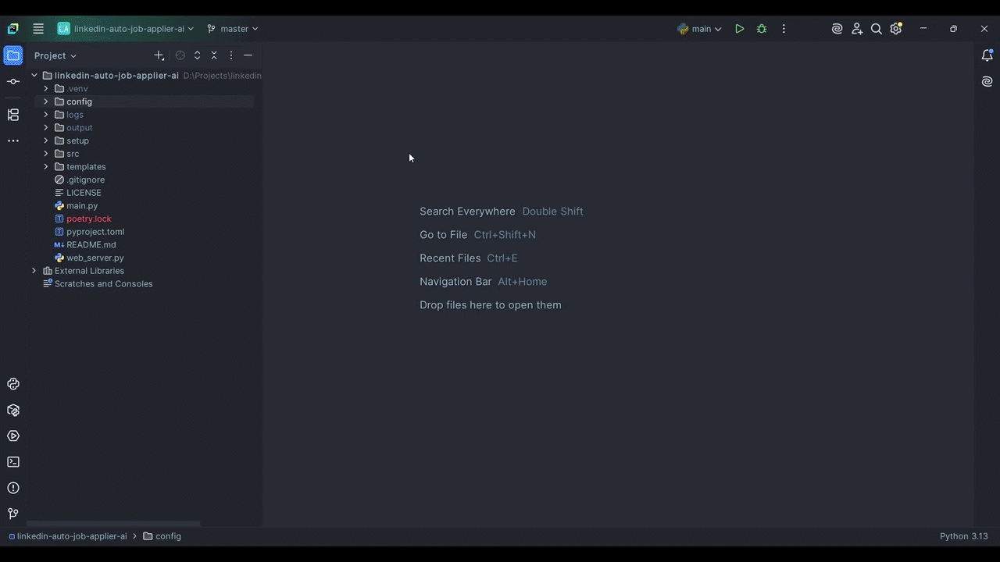

# 🚀 LinkedIn Auto Job Applier AI

<p align="center">
  <b>AI-powered LinkedIn Easy Apply automation tool with smart filtering, anti-detection, and real-time dashboard</b>
</p>

<p align="center">
  <a href="https://www.python.org/">
    
  </a>

  <a href="https://github.com/Ajinkya-Kardile/linkedin-auto-job-applier-ai">
    
  </a>

  <a href="https://www.linkedin.com/in/ajinkya-kardile/">
    
  </a>

  <a href="./LICENSE">
    
  </a>
</p>

---

## 🔥 Overview

**LinkedIn Auto Job Applier AI** is a powerful automation tool that helps you **search, filter, and apply to LinkedIn Easy Apply jobs automatically** using AI.

It mimics real human behavior, avoids bot detection, and intelligently answers job application questions using LLMs like **OpenAI** and **Google Gemini**.

---

## 🎯 Why This Project Stands Out

* 🔥 Fully automated **end-to-end pipeline**
* 🧠 AI-powered decision making
* 🛡️ Built-in anti-detection strategies
* ⚡ Scales to hundreds of applications
* 📊 Real-time monitoring dashboard

---

## 📸 Demo

<p align="center">
  
</p>

---

## ⚙️ How It Works (End-to-End Pipeline)

### 🔐 1. Authentication & Stealth Layer

* **Stealth Browsing**: Uses `undetected-chromedriver` to minimize bot detection
* **Session Persistence**: Reuses Chrome profile to avoid repeated logins & captchas
* **Automatic Login**: Smart login with manual fallback when needed

---

### 🔎 2. Job Discovery Engine

* **Dynamic Search Execution**: Iterates through roles, locations, and keywords
* **Platform Filters Applied**: Easy Apply, Experience Level, Date Posted, Remote/On-site
* **High-Volume Processing**: Handles hundreds of listings efficiently

---

### 🧠 3. Intelligent Job Screening

* **Keyword Filtering**: Skips irrelevant roles automatically
* **Company Blacklist**: Avoids unwanted companies
* **Experience Matching**: Filters jobs beyond your experience level
* **AI Skill Extraction**: Detects required skills from job descriptions

---

### ⚙️ 4. Easy Apply Automation Engine

* **Multi-Step Form Navigation**: Handles Next → Review → Submit flows
* **Automatic Resume Upload**: Detects and uploads resume
* **Company Follow Control**: Configurable follow/unfollow

---

### 🤖 5. AI-Powered Form Filling

* **Universal Form Handling**: Works with all input types
* **Predefined Answers**: Uses structured personal configs
* **LLM Integration (OpenAI, Gemini, DeepSeek)**:

  * Generates **human-like answers in real-time**
  * Uses resume + job description for personalization

---

### 📊 6. Tracking & Dashboard

* **CSV Logging**: Stores all applications with metadata
* **Flask Dashboard**: Real-time analytics (applications, success rate, stats)

---


## ⚡ Quick Start

### 1. Clone Repository

```bash
git clone https://github.com/Ajinkya-Kardile/linkedin-auto-job-applier-ai.git
cd linkedin-auto-job-applier-ai
```

### 2. Setup Environment

```bash
python -m venv .venv
source .venv/bin/activate  # Windows: .venv\\Scripts\\activate
```

### 3. Install Dependencies

```bash
pip install .
```

---

## ⚙️ Configuration Guide

Configure files inside `config/`:

| File          | Purpose                |
| ------------- | ---------------------- |
| `secrets.py`  | Credentials & API keys |
| `personal.py` | Personal details       |
| `search.py`   | Job filters & keywords |
| `questions.py` | Predefined answers     |
| `settings.py` | Bot limits & delays    |

⚠️ Never commit `secrets.py`

---

## ▶️ Usage


#### Note: Fix Ubuntu Permission Error
```bash
xhost +local:
```
### Run Bot
```bash
python main.py
```

### Run Dashboard

```bash
python web_server.py
```

Open: [http://127.0.0.1:5000](http://127.0.0.1:5000)

---

## 🏗️ Project Structure

```
linkedin-auto-job-applier-ai/
├── config/               # Configuration settings and Pydantic schemas
├── setup/                # Environment setup scripts (Windows, Linux, macOS)
├── src/                  # Main source code directory
│   ├── ai/               # AI integrations (OpenAI, Gemini, DeepSeek clients & prompts)
│   ├── browser/          # Selenium web driver setup, DOM interactors, and LinkedIn scraper
│   ├── core/             # Bot engine, easy-apply flow, and dynamic form handlers
│   ├── data/             # CSV manager for tracking application history
│   └── utils/            # Helper functions and customized logger
├── templates/            # HTML templates for the Flask web dashboard
├── main.py               # Main bot execution script
├── web_server.py         # Flask web server for the real-time dashboard
└── pyproject.toml        # Project dependencies and metadata
```

---

## 🚀 SEO Keywords (for discoverability)

LinkedIn automation bot, LinkedIn Easy Apply bot, AI job applier, job automation tool, OpenAI job bot, Gemini AI automation, Python job bot, LinkedIn scraper bot, auto apply jobs LinkedIn

---

## ⚠️ Disclaimer

This project is intended for **educational and research purposes only**.

- It is not affiliated with or endorsed by LinkedIn
- Automating interactions may violate LinkedIn's Terms of Service
- The author is not responsible for account restrictions, bans, or any misuse
- Users are solely responsible for how they use this software

---

## 🤝 Contributing

Contributions are welcome!

```bash
# Fork the repo
# Create your branch
git checkout -b feature/your-feature

# Commit changes
git commit -m "Add feature"

# Push
git push origin feature/your-feature
```

---

## ⭐ Support

If this project helps you:

* ⭐ Star the repo
* 🍴 Fork it
* 📢 Share it

---

## 👨‍💻 Author

**Ajinkya Kardile**

---

## 📜 License

MIT License
